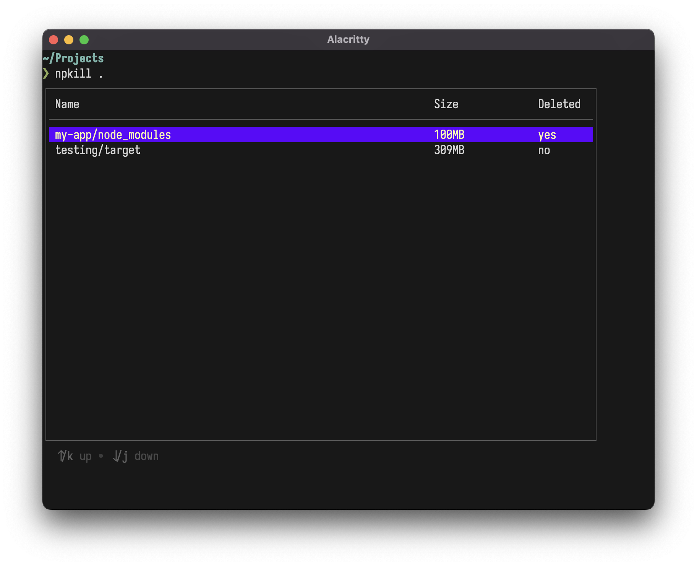

# npkill-go

A clean TUI to delete your old `target` and `node_modules`.

## Usage

### Starting npkill

`$ npkill <directory>` opens npkill in a directory _relative_ to `$PWD`.

`$ npkill` opens npkill in `$PWD`.

### Interactions

Move through the table with the arrow keys (`↑`, `↓`).

Refresh the list of entries with `r`.

Delete an element with `⏎`.

Quit with `Esc`.

## Building it

Make sure you have a [Go Toolchain](https://go.dev/dl/) installed on your system.

`$ go build .` produces the executable.
